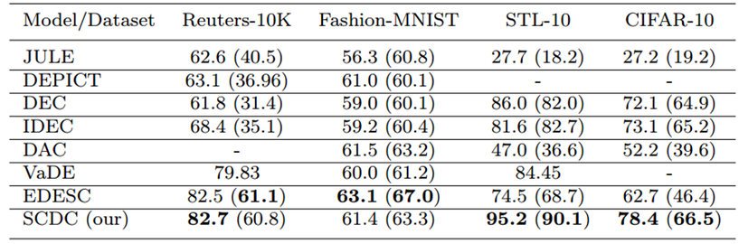
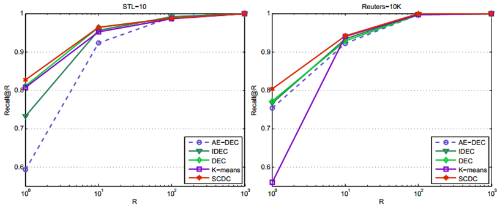
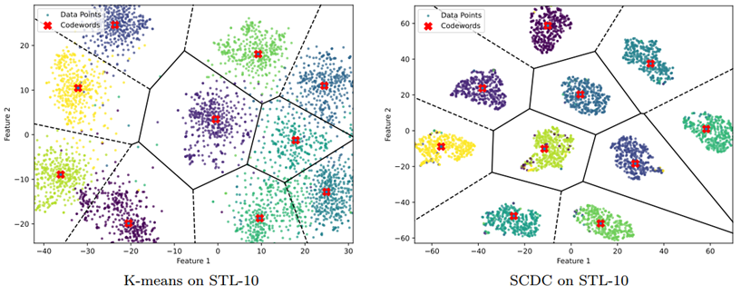
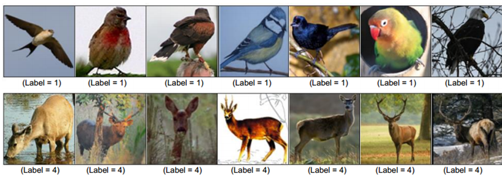

## AN EFFECTIVE DEEP CLUSTERING MODEL FOR FEATURE QUANTIZATION AND REPRESENTATION

**INTRODUCTION:** Recent advances in deep learning have drawn significant  attention to the problem of deep clustering. This paper presents a deep neural model, namely SCDC (Soft-Center loss for Deep Clustering), whose design is based  on an autoencoder architecture that mainly focuses on data clustering. To this end, a novel loss function, also known as soft-center loss, is presented to drive the training process. The new objective is closely related to the K-means loss function and helps promote clustering-specific features in the representation space. Additionally, the model is regularized using reconstruction loss and enhanced with a clustering-oriented loss. Furthermore, our investigation is linked to the problem of feature quantization and representation with the target of efficient support for the task of  approximated nearest neighbor (ANN) search.  To achieve this, we have presented the general pipeline, including model training, codebook generation, feature quantization, and searching. Notably, we have conducted extensive visual analytics on the learned representations and compact codebooks to assess the discrimination capability of the proposed model. Experimental results showed that SCDC is competitive with many modern clustering models on several benchmark  datasets and delivers high-quality coding for ANN search.

**DATASETS:** We have selected 4 classification benchmark datasets including: Reuters, Fashion-MNIST, CIFAR-10, and STL-10. Due to memory limitation of our GPU machine, it is not possible to handle the whole CIFAR-10 dataset composing of 60,000 images. Hence, we randomly sampled 30,000 images for evaluation. For Reuters dataset, we have selected the Reuters-10K dataset that have been used for comparative evaluation in the work EDESC at this host: https://github.com/JinyuCai95/EDESC-pytorch.


### RESULTS:

•	**Clustering Accuracy:** 

Table 1 presents the comparative results of all the studied clustering methods. A key observation is that while each model performs reasonably well on certain datasets, no single method dominates across all benchmarks. Notably, SCDC achieves superior accuracy results on STL-10 (ACC=95.2%) and CIFAR-10 (ACC=78.4%). In terms of NMI scores, our model also significantly outperforms other methods, particularly on two benchmark datasets: CIFAR-10 (NMI=66.5%) and STL-10 (NMI=90.1%).

Table 1. Clustering scores: ACC and NMI (in bracket). The minus symbol (-) indicates no applicable results. The best results are marked in bold.

•	**Quantization Quality:**

 In this experiment, each dataset is divided into two subsets: a query set containing 1000 random samples and a database consisting of the remaining points. All the clustering models are trained on the database and then evaluated on the query subset by using the metric Recall@R.

Figure 1. Evaluation of coding quality by using vector quantization on 2 datasets of different clustering model.

•	**Visual Analysis:**

Figure 2 show Voronoi-based visualization of codeword distributions within feature spaces. This is achieved by applying a dimensionality reduction technique (e.g., t-SNE) to the feature points and codewords generated by clustering models on STL-10, followed by the Voronoi transformation.

Figure 2. Voronoi-based visualization of codewords in feature spaces for STL-10 of SCDC and DEC model. The codewords are represented by the symbol ‘X’, while each data point is color-coded to reflect its true cluster label.

•	**Vision Applications:**

The discriminative representations learned by the proposed model can be applied to a wide range of practical tasks, including image classification, pattern recognition, and image retrieval. Here, we present a practical application demonstrating the effectiveness of deep clustering models for ANN search or image retrieval.

Figure 3. ANN search demonstration of SCDC model for STL-10. From left to right: a query and its 6 nearest answers. The labels are shown at the bottom of each image.

•	**CITATION:**

```
Thi-Anh-Loan Trinh and The-Anh Pham, "An effective deep clustering model for feature quantization and representation", Information Visualization (In Press), 2025, https://doi.org/10.1177/1473871625134296.
```

• **Link to the paper:**  
[https://doi.org/10.1177/14738716251342965](https://doi.org/10.1177/14738716251342965)